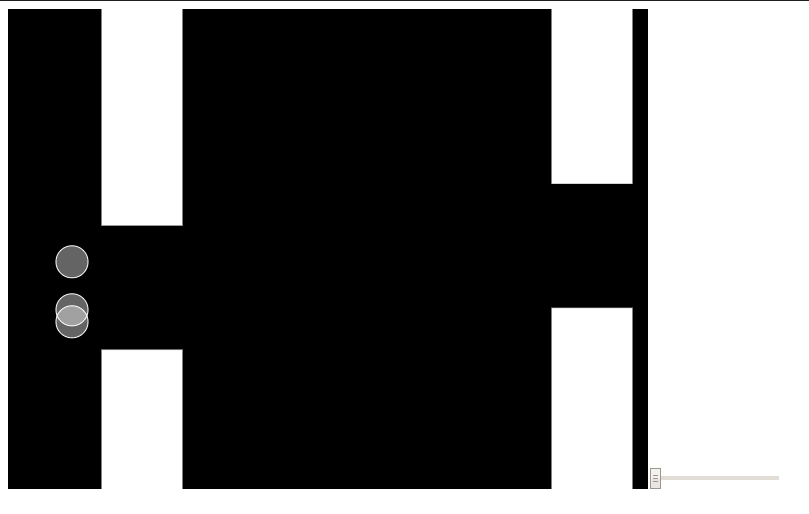

# Flappy Bird - NeuroEvolution
Neuroevolution, or neuro-evolution, is a form of artificial intelligence that uses evolutionary algorithms to generate artificial neural networks (ANN), parameters, topology and rules.It is most commonly applied in artificial life, general game playing and evolutionary robotics. The main benefit is that neuroevolution can be applied more widely than supervised learning algorithms, which require a syllabus of correct input-output pairs. In contrast, neuroevolution requires only a measure of a network's performance at a task. For example, the outcome of a game (i.e. whether one player won or lost) can be easily measured without providing labeled examples of desired strategies. Neuroevolution is commonly used as part of the reinforcement learning paradigm, and it can be contrasted with conventional deep learning techniques that use gradient descent on a neural network with a fixed topology.

#

## Solution
displaying how the solutions works (in the browser) using : 

* [P5](https://p5js.org/) - a free and open-source JavaScript library with a full set of drawing functionality.

* [TensorFlow.js] (https://www.tensorflow.org/js) - TensorFlow.js is a library for machine learning in JavaScript