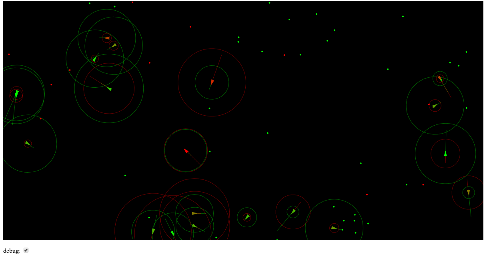

#Evolutionary "Steering Behavior" Simulation
# 
It’s an ecosystem where the organisms (autonomous steering agents) clone themselves. The autonomous steering agents evolve the behavior of eating food (green dots) and avoiding poison (red dots).The debug function will show extra properties about the agents 
##Libraries used 
* [P5](https://p5js.org/) - a free and open-source JavaScript library with a full set of drawing functionality.